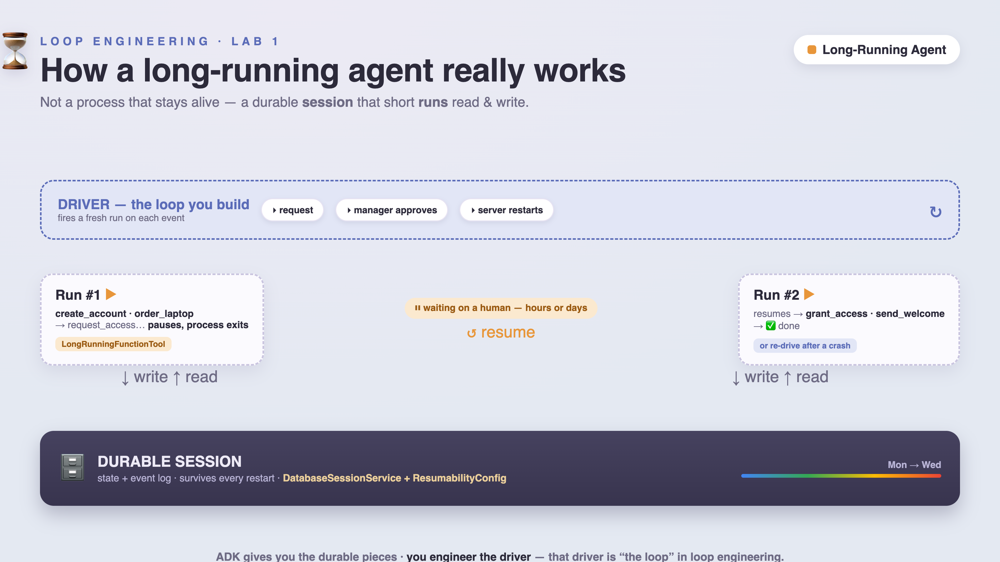

author: Annie Wang (cuppibla)
summary: Build a long-running AI agent with Google's ADK — one that survives crashes, pauses for a human, and never double-acts. You'll go from a toy that loses everything when it crashes to a durable, resumable, human-in-the-loop agent, one idea at a time.
id: lab1-long-running-agent
categories: ai,adk,agents,gemini
environments: Web
status: Draft
feedback link: https://github.com/cuppibla/loop-lab-onboarding/issues

# Lab 1: The Long-Running Agent

## Overview
Duration: 3:00

It's Monday, 9:00 a.m. **Alice** is starting her first day. Somewhere, an agent is supposed to
create her accounts, order her laptop, get her manager to approve production access, and send
her a welcome note.

Simple, right? You wire up an agent, it calls five tools, done. It even works in your demo.

Then reality happens. The onboarding takes **two days**, not two seconds — it waits on a
manager who's in meetings until Wednesday. Halfway through, the server it's running on gets
redeployed and **the process dies**. When someone restarts it… Alice now has **two MacBooks**
on the way, and her access request has vanished into the void.

That gap — between the agent that works in a demo and the agent that survives the real world —
is what this codelab is about.

### What you'll build

You'll build an **onboarding agent** with Google's **Agent Development Kit (ADK)** and, step by
step, turn it into a proper **long-running agent**. By the end it will:

- ✅ **survive a crash** and resume from the exact step it died on,
- ✅ **pause for a manager's approval** — for minutes or days — and continue when it arrives,
- ✅ and **never order Alice two laptops**, even when a crash makes it re-run a step.

### What you'll learn

- Why a long-running agent is **not** "a process that stays alive," and what it is instead.
- How ADK persists an agent so it survives a restart (`DatabaseSessionService`).
- How to make an agent **pause for a human** and resume later (`LongRunningFunctionTool`).
- How to **recover from a crash** mid-run (`ResumabilityConfig`).
- **Idempotency** — the one discipline that separates a real long-running agent from a bug that
  runs twice.
- How to take the exact same code to **Google Cloud** (Cloud SQL + Agent Runtime).

### Who this is for

Anyone who's built a basic ADK (or any) agent and now wants to run one for real. You should be
comfortable in a terminal and know a little Python. No cloud account required for the core lab.

Each step lives in its own folder (`01_baseline` → `06_cloud`) and adds **exactly one idea**, so
you can always `diff` two neighbours to see precisely what changed.

> 📦 **All the code is on GitHub:** [github.com/cuppibla/loop-lab-onboarding](https://github.com/cuppibla/loop-lab-onboarding) — you'll clone it in Setup, and every step links to its folder.

## The big idea: how a long-running agent really works
Duration: 5:00

Before we touch code, let's fix the mental model — because almost everyone gets it wrong at
first, and once you get it right, the rest of the lab is easy.



### The wrong picture

Most people imagine a long-running agent as **a process that stays running** for hours or days,
sitting in memory, "thinking," waiting. Like this:

```
[ one Python process, alive for 2 days ]  ← wrong
  create_account …… waiting …… waiting …… approval! …… grant_access …… done
```

That's a disaster. A process that lives for two days will be redeployed, OOM-killed, or crash.
The moment it dies, everything in memory is gone.

### The right picture

A long-running agent is **not** a process that stays alive. It's this:

> **A long-running agent = a durable _session_ that many short-lived _runs_ read and write,
> plus a _driver_ that starts a new run whenever there's something to do.**

```
                 (durable session lives in a database, for days)
  run #1  ─────────────►  pauses / ends, process EXITS  🡒  nothing in memory
     …(hours pass; a manager approves)…
  run #2  ─────────────►  resumes from the DB, finishes
```

The agent itself is almost **stateless**. All the state lives in the **session** (in a
database). The continuity comes from a small piece of code — the **driver** — that fires a
fresh run whenever an event says "there's work to do": a request comes in, a manager approves,
a timer fires, or the server restarts.

**Analogy:** think of a **save-game**. You don't leave the console on for a week to keep your
progress. The game **saves to disk**; you can quit, come back tomorrow, load, and continue
exactly where you were. Our agent works the same way — the session is the save file, and the
driver is you pressing "Continue."

### The four pieces that make it real

Everything in this lab is one of these four pieces:

| # | Piece | What it does | Who gives it to you |
|---|---|---|---|
| 1 | **Durable session** | state lives in a DB, not memory | ADK `DatabaseSessionService` (Step 2) |
| 2 | **Resumable runs** | replay finished steps, re-run the unfinished one | ADK `ResumabilityConfig` (Step 4) |
| 3 | **Pause / resume** | end the run, continue later on an external event | ADK `LongRunningFunctionTool` (Step 3) |
| 4 | **The driver + idempotency** | the loop that re-drives runs, safely | **you** (Steps 3–5) — this is the "engineering" |

ADK hands you 1–3. Piece **4 is the part you build** — and it's why this discipline is called
_loop engineering_: **the loop is the driver.**

Keep this table in mind. Each step from here just fills in one row.

### Walking through Alice's onboarding, piece by piece

Let's ground this in the actual story from the top of the page, so the four pieces stop being
abstract:

| Moment in Alice's onboarding | Piece involved | What's actually happening |
|---|---|---|
| Monday 9am: agent creates her account, orders her laptop | Durable session | Each result is written to the DB as it happens — not held in RAM "for later" |
| Manager is in meetings until Wednesday | Pause / resume | The run **ends** the moment `request_access` returns "pending." No process is sitting there waiting for two days |
| Wednesday: manager clicks approve | Pause / resume | A brand-new process starts a brand-new run, on the same session, and continues from `AWAITING_APPROVAL` |
| Server gets redeployed mid-run | Resumable runs | The next run replays everything already logged, then re-runs only the one step that never finished |
| The re-run step happens to be "order the laptop" again | Driver + idempotency | This is the trap. Without a guard, Alice gets two laptops. This is **piece 4**, and it's the one nothing hands you for free |

> aside positive
> **The single biggest reframe in this lab:** at **no point** is there a process alive for two
> days. The "long" in "long-running agent" describes the **task** (it takes days), not the
> **process** (which lives for milliseconds to seconds per run). Every step below is just a
> mechanism for making a days-long *task* out of a series of tiny, disposable *runs*.

### Common misconception: "isn't this just `async`/`await`?"

If you've written async code before, the pause/resume behavior might look like `await`ing a
slow call. It's a tempting but wrong mental model — and worth killing now, because it'll bite
you every step from here on.

| | `await some_slow_call()` | This lab's pause/resume |
|---|---|---|
| Where does execution live while waiting? | On the stack, inside the running process | Nowhere — the process has exited |
| What survives if the machine reboots? | Nothing. The `await` is gone | Everything. It's a row in a database |
| What resumes it? | The same coroutine, when the awaited call returns | Any process, possibly on a different machine, sending a message |
| How long can it wait? | Seconds, maybe minutes — bounded by the process's lifetime | Minutes, days, weeks — bounded by nothing |

> aside positive
> **The one-line difference:** `await` suspends a *stack frame in memory*; what we're building
> suspends an *entry in a database*. That's why a manager can approve Alice's access two days
> later, from any machine, long after the original Python process — and even the original
> *server* — no longer exists.

## Setup
Duration: 5:00

👉💻 **Clone the repo** (you'll `cd` into a different folder for each step):
```bash
git clone https://github.com/cuppibla/loop-lab-onboarding.git
cd loop-lab-onboarding
```

👉💻 **Create the environment.** The script picks a Python 3.10+ interpreter, makes a `.venv`,
and installs the pinned dependencies:
```bash
./setup_venv.sh          # Windows: setup_venv.bat
source .venv/bin/activate
```
> 🧰 **Prefer uv?** Run `uv sync` instead, and use `uv run python …` wherever the codelab says
> `python …`. Everything else is identical.

### Get your Gemini API key

The agent calls Gemini, so it needs a key. This is free from Google AI Studio and takes about a
minute — **no billing and no cloud project required** for the core lab.

👉 **Get the key:**

1. Go to **[aistudio.google.com/apikey](https://aistudio.google.com/apikey)** and sign in with
   your Google account.
2. Click **Create API key** (top-right).
3. In the dialog, either pick an existing Google project or let it create a new one for you.
4. Copy the key it shows you. It **starts with `AIza…` and is about 40 characters** long.

> aside negative
> **Treat the API key like a password.** Don't paste it into public chats, screenshots, or issues,
> and never commit it to a public GitHub repo. The `.env` file below is already in `.gitignore`
> so your key stays local — keep it that way.

👉 **Add the key to your `.env`.** Open the `.env` file at the repo root and set these two lines
(replace `AIza…your-key…` with the key you just copied):
```
GOOGLE_API_KEY=AIza…your-key…
GOOGLE_GENAI_USE_VERTEXAI=False
```

> aside positive
> **What these two lines mean:**
> - `GOOGLE_API_KEY` — your AI Studio key; how the agent authenticates to Gemini.
> - `GOOGLE_GENAI_USE_VERTEXAI=False` — tells ADK to use the **AI Studio** key directly, *not*
>   Vertex AI. (We flip this to Vertex only in the very last Cloud step, and only if you choose to.)

That's it — no cloud project needed until the very last step.

> ℹ️ **About the "systems":** to keep the focus on *durability* (not integrations), every
> external system — the account service, the laptop store, the access system — is a local stub
> in `fake_systems.py` that just writes a row to a JSON file. That's what lets us *count* side
> effects and *prove* the two-laptops bug later.

## Step 1 · Run the baseline (and watch it vanish)
Duration: 5:00

📂 **Code for this step:** [`01_baseline/`](https://github.com/cuppibla/loop-lab-onboarding/tree/main/01_baseline)

Let's meet the agent. It's an ordinary ADK agent with five tools that run in order.

👉💻 **Run the baseline onboarding:**
```bash
cd 01_baseline
python driver.py Alice
```

**Expected output:**
```
    -> create_account({'employee': 'Alice'})
    -> order_laptop({'employee': 'Alice'})
    -> request_access({'employee': 'Alice', 'system': 'prod'})
    -> grant_access({'employee': 'Alice', 'system': 'prod'})
    -> send_welcome({'employee': 'Alice'})
    <agent> ONBOARDING COMPLETE
```

**What just happened:** the Gemini model read its instructions and called the five tools in
order. Here's the whole agent (`01_baseline/agent.py`), trimmed:

```python
def order_laptop(employee: str) -> dict:
    return {"status": "ok", "order_id": fake_systems.order_laptop(employee)}
# … create_account, request_access, grant_access, send_welcome …

root_agent = Agent(
    name="onboarding",
    model="gemini-3-flash-preview",
    instruction="… do these five steps in order, one tool call at a time …",
    tools=[create_account, order_laptop, request_access, grant_access, send_welcome],
)
```

The `driver.py` here is as simple as it gets: it uses an **`InMemorySessionService`**, sends
one message, and streams the events.

### Why this matters

This is the agent 90% of tutorials stop at. It's fine — *until something goes wrong.*

👉 **Try to break it:** run it again, and while it's printing, press **Ctrl-C**.

There is no `onboarding.db`. There is no saved progress. **Everything was in RAM, and it's
gone.** If this were Alice's real onboarding, you'd have no idea which steps finished and which
didn't. Did the laptop get ordered? Nobody knows.

A real onboarding spans days and *will* be interrupted. So the very first thing we need is
**durability** — piece #1. `cd ..`

## Step 2 · Make it survive (persistence)
Duration: 8:00

📂 **Code for this step:** [`02_persistence/`](https://github.com/cuppibla/loop-lab-onboarding/tree/main/02_persistence)

The fix for "it's all in RAM" is to move the state out of RAM and into a **database**. In ADK,
that's the job of a **`SessionService`**.

👉💻 **Run it, then read the result from a _separate_ process:**
```bash
cd 02_persistence
python driver.py reset
python driver.py start Alice
python driver.py status Alice      # a brand-new process, reading from disk
```

**Expected output** (note: the `status` line is printed by a *fresh* process that ran *after*
`start` finished):
```
[status] Alice: stage=DONE  {'accounts': 1, 'laptop_orders': 1, 'access_grants': 1, 'welcomes': 1}
```

### What changed (it's basically one line)

```python
from google.adk.sessions import DatabaseSessionService
session_service = DatabaseSessionService(db_url="sqlite+aiosqlite:///./onboarding.db")
```

That's the whole idea of a **durable session**. Under the hood, as the agent runs, ADK writes
every **event** (each tool call, each tool result, each change to `state`) into that database.
We also gave each step an explicit progress marker:

```python
tool_context.state["stage"] = "LAPTOP_ORDERED"
```

> 💡 **Why an explicit `state["stage"]`?** We *could* infer progress from the chat history, but
> a model can hallucinate "I already did that." A plain, boring state variable is the source of
> truth the resume logic will rely on later. **State is data, not vibes.**

> ⚠️ **Gotcha worth knowing:** `DatabaseSessionService` uses an **async** database driver. For
> SQLite that means the URL is `sqlite+aiosqlite://…` (not plain `sqlite://`), and you need the
> `aiosqlite` + `greenlet` packages. We've pinned those for you. When we go to Cloud SQL in
> Step 6, the same rule means `postgresql+asyncpg://` — **not** the sync `pg8000`.

### What just happened

Kill this process any time and the progress is safely on disk in `onboarding.db`. That's real
progress over Step 1.

### But we're not done

👉 Here's the catch. You can *read* the saved stage — but there's still **no way to continue an
interrupted run.** The state is a photograph, not a pause button.

> **Persisted ≠ resumable.** Saving where you are is necessary but not sufficient; you also need
> a mechanism to *pick up from there*. That's the next two steps.

`cd ..`

## Step 3 · Pause for a human (the first "kill the server")
Duration: 10:00

📂 **Code for this step:** [`03_human_approval/`](https://github.com/cuppibla/loop-lab-onboarding/tree/main/03_human_approval)

Some actions you never let an agent do alone. Granting **production access** is one of them —
a human manager has to approve it. And that approval might take **days**.

This is the heart of a long-running agent, so let's go slowly.

### The mechanism: a tool that returns "pending"

We turn `request_access` into a **`LongRunningFunctionTool`**:

```python
from google.adk.tools import LongRunningFunctionTool

def request_access(employee: str, system: str, tool_context: ToolContext) -> dict:
    tool_context.state["stage"] = "AWAITING_APPROVAL"
    return {"status": "pending", "message": f"awaiting manager approval for {system}"}

tools=[ …, LongRunningFunctionTool(request_access), … ]
```

Here's the key behavior, and it's different from a normal tool: when the agent calls a
long-running tool and it returns **`pending`**, **the run ends.** The process is free. There's
no thread blocked somewhere "waiting." All that's left is a **paused invocation sitting in the
durable session** — a note that says "we're waiting on `request_access`."

### Wait — doesn't the run just... hang there?

No, and this is the part people trip on. Nothing is "waiting" anywhere. Walk through exactly
what happens, in order:

1. The agent calls `request_access(...)`.
2. The tool function returns immediately — `{"status": "pending", ...}`. It does **not** block.
3. ADK sees this came from a `LongRunningFunctionTool` and writes one more fact to the durable
   session: *"there is an unanswered function call, id `xyz`, waiting for a
   `function_response`."*
4. The run **ends** — normally, not with an error. `driver.py` gets control back and the Python
   process exits.

At this instant, there is genuinely **nothing running**. Not a thread, not a coroutine, not a
process. If you `ps aux` right now you'll find nothing related to Alice's onboarding. The *only*
thing that exists is a row in `onboarding.db` saying "call `xyz` is still open." Everything
about "the agent is waiting for the manager" lives entirely in that row — the agent program
itself has no idea two days are passing.

> aside positive
> **The mental shift:** a long-running tool doesn't make the *tool* run for a long time. It
> makes the *tool call* stay open — as a fact in a database — for as long as it takes someone to
> answer it. The "long-running" part is a gap in the data, not a thread in memory.

### See it pause

👉💻
```bash
cd 03_human_approval
python driver.py reset
python driver.py start Alice
```

**Expected output** — watch for `[PAUSE: awaiting human]`, then the process **exits**:
```
    -> create_account({'employee': 'Alice'})
    -> order_laptop({'employee': 'Alice'})
    -> request_access({'employee': 'Alice', 'system': 'prod'}) [PAUSE: awaiting human]
[status] Alice: stage=AWAITING_APPROVAL  {'accounts': 1, 'laptop_orders': 1, 'access_grants': 0, …}
```

👉 **Now do the dramatic thing:** close this terminal entirely. Kill it. The agent is
"mid-onboarding," waiting on a human — and there is **nothing running.** Nothing is lost,
because the pending approval is in the database.

### Resume it — from a completely fresh process

👉💻 Open a **new** terminal (re-`source .venv/bin/activate`, `cd 03_human_approval`) and play
the manager:
```bash
python driver.py approve Alice
```

**Expected output** — a different process picks up exactly where the first one paused:
```
[approve] manager approves → resume via function_response request_access(…)
    -> grant_access({'employee': 'Alice', 'system': 'prod'})
    -> send_welcome({'employee': 'Alice'})
    <agent> ONBOARDING COMPLETE
[status] Alice: stage=DONE  …
```

### What just happened (this is the important part)

**Resuming is just sending the tool's answer back.** The driver builds a **`function_response`**
— "here's the result of that pending `request_access`: `{approved: true}`" — and sends it into
a new run on the **same session**. ADK matches it to the paused call and continues.

```python
resume = types.Content(role="user", parts=[types.Part(
    function_response=types.FunctionResponse(
        id=pending_call_id, name="request_access", response={"approved": True}))])
runner.run_async(session_id="s-Alice", new_message=resume)   # a fresh run
```

> 💡 **Why this is beautiful:** because "resume" is just a normal message, it works with **any**
> session backend and **any** amount of elapsed time. Minutes or days later, on a different
> machine, you send one message and the onboarding continues. We didn't even need crash-recovery
> machinery for this — pausing for a human is a *clean* end-of-run.

> 🔒 **The design point:** this is a **locked door**, not a polite sign. The model can *ask* for
> access, but it physically cannot grant it — the run ends and only a human's approval
> (`{approved: true}`) reopens it. That's real control, not a hopeful prompt.

`cd ..`

## Step 4 · Survive a crash
Duration: 10:00

📂 **Code for this step:** [`04_crash_recovery/`](https://github.com/cuppibla/loop-lab-onboarding/tree/main/04_crash_recovery)

Step 3 handled a **clean** pause — the run ended tidily and we chose when to resume. But a real
crash isn't clean. The process dies **mid-run**, in the middle of executing, with no chance to
tidy up. Can we recover from *that*?

### The mechanism: replay the finished steps

We add one thing to the `App`:

```python
from google.adk.apps.app import App, ResumabilityConfig
app = App(name="onboarding", root_agent=root_agent,
          resumability_config=ResumabilityConfig(is_resumable=True))
```

With resumability on, ADK treats its **event log** as a journal. Each completed step is an
event on disk. When you re-drive a crashed invocation, ADK **replays the completed events**
(without re-executing them) and **re-runs only the step that was unfinished**:

```
events on disk:   [create_account ✅]  [order_laptop ✅]  [ ??? crash ??? ]
re-drive        →  replay ✅            replay ✅           RE-RUN this one → continue
```

> ℹ️ **Two different "resumes."** Step 3's approval-resume sends a `function_response` (a clean
> continuation). This crash-resume is different: you re-drive the **unfinished invocation** by
> its id, with no new message. Same durable session, two entry points.

### What "replay" actually does (and doesn't do)

This is the step where people quietly assume something false: that "replay" means "run the
agent again from the top." It doesn't. Here's the distinction that matters:

- **Replaying an event** = ADK reads the logged tool *call* and tool *result* back into context,
  exactly as they happened, and does **not** call the tool function again. `create_account`'s
  code never executes a second time — ADK just re-tells the model "you already called this, and
  here's what it returned."
- **Re-running a step** = the one step whose result was never logged gets executed for real,
  because as far as the durable session can tell, it never happened.

> aside positive
> **Analogy: a bank statement, not a bank teller.** Replay is like handing the agent its own
> bank statement for the days it was down — "on Tuesday you did X, on Wednesday you did Y" — so
> it can pick up Thursday with full context, without re-doing Tuesday and Wednesday. If the
> statement is missing an entry because the branch closed mid-transaction, that's the one
> transaction that has to happen again. That gap is exactly what Step 5 is about.

> aside negative
> **The dangerous case, in one sentence:** if the crash lands **inside** a step — after the
> real-world side effect fired but before the log entry was written — replay can't tell the
> difference between "never started" and "finished but unlogged," so it re-runs the step. That's
> why the demo crashes **between** steps to show "no repeated work" — and why Step 5 deliberately
> crashes *inside* one to expose the two-laptops bug. Keep this in your back pocket.

### Try it

👉💻
```bash
cd 04_crash_recovery
python driver.py reset
python driver.py start Alice
```

👉 While it's printing, mash **Ctrl-C** to kill it between steps. Then bring it back:

💻
```bash
python driver.py resume Alice
```

It replays what finished and continues from where it died — no repeated work.

### The question that makes or breaks everything

You just saw resume **replay completed steps and re-run the unfinished one.** That's exactly
what you want… until you ask:

👉 **What if the crash lands _inside_ a step that already did something in the real world —
like _ordering a laptop_ — but before that step was written to the log?**

Then "re-run the unfinished step" means "order the laptop **again**." Hold that thought — it's
the whole next step. `cd ..`

## Step 5 · Don't order two laptops (idempotency)
Duration: 12:00

📂 **Code for this step:** [`05_idempotency/`](https://github.com/cuppibla/loop-lab-onboarding/tree/main/05_idempotency)

This is the most important step in the lab. It's the difference between an agent that *looks*
crash-safe and one that actually is.

### Reproduce the bug

Let's engineer the nasty crash: `order_laptop` fires its side effect (orders the laptop) and
then the process dies **before that step is logged.** On resume, ADK sees `order_laptop` as
unfinished and runs it again.

👉💻 **Guard OFF, crash right after ordering:**
```bash
cd 05_idempotency
python driver.py reset
IDEMPOTENT=0 CRASH_AFTER_ORDER=1 python driver.py start Bob    # orders a laptop, then crashes
IDEMPOTENT=0 python driver.py resume Bob                       # re-runs order_laptop
```

**Expected output — wince at this:**
```
[status] Bob: stage=AWAITING_APPROVAL  {'accounts': 1, 'laptop_orders': 2, …}   ← TWO laptops
```

Bob has two MacBooks on the way. In a real system this is a double charge, a duplicate email, a
second wire transfer. **Recovery re-ran a side effect.**

### The fix: check before you act

The fix is **idempotency** — making a step safe to run more than once. We guard the side effect
with a check:

```python
def order_laptop(employee: str, tool_context: ToolContext) -> dict:
    if fake_systems.has_laptop_order(employee):     # ← ask FIRST
        return {"status": "already_ordered"}         # already done → do nothing
    order_id = fake_systems.order_laptop(employee)   # the real side effect
    tool_context.state["stage"] = "LAPTOP_ORDERED"
    return {"status": "ok", "order_id": order_id}
```

👉💻 **Guard ON, same crash:**
```bash
python driver.py reset
CRASH_AFTER_ORDER=1 python driver.py start Carol
python driver.py resume Carol
```

**Expected output:**
```
[status] Carol: stage=AWAITING_APPROVAL  {'accounts': 1, 'laptop_orders': 1, …}   ← ONE laptop
```

Same crash, same resume — but Carol gets exactly one laptop.

### Why the guard lives where it does (subtle but important)

Notice the guard checks `fake_systems`, an **independent store** — *not* `session.state`.

> 💡 **Why not `state`?** Because `state` changes are themselves events in the log, and in our
> crash window the process died **before** the log was flushed. If the guard relied on `state`,
> the guard's own memory would have been lost in the same crash. The idempotency record has to
> live somewhere that is written **as part of the side effect itself** — the same place the
> laptop order is recorded. In production this is an **idempotency key**: a unique id for "this
> particular action" that the downstream system (the laptop vendor, the payment API) uses to
> de-duplicate.

### The lesson

> **Recovery re-runs steps. So every step with a real-world side effect must be idempotent.**
>
> *A loop that recovers but doesn't guard its side effects is just a bug that runs twice.*

This is the discipline that separates piece #4 (the part *you* engineer) from a toy. ADK gave
you resumability; **you** made resumability *safe*. `cd ..`

## Step 6 · Take it to Google Cloud
Duration: 8:00

📂 **Code for this step:** [`06_cloud/`](https://github.com/cuppibla/loop-lab-onboarding/tree/main/06_cloud)

Here's the payoff of the whole design: **nothing about your agent changes to go to
production.** Only the *connection* changes.

> **"Durability is a connection string, not a rewrite."**

### Option A — Cloud SQL for PostgreSQL

Your session store was `DatabaseSessionService`. Point it at a managed Postgres instead of a
local file:

```python
# local (Steps 2–5):  sqlite+aiosqlite:///./onboarding.db
# cloud:              postgresql+asyncpg://…   (via the Cloud SQL Python Connector)
```

See [`06_cloud/cloudsql_engine.py`](https://github.com/cuppibla/loop-lab-onboarding/blob/main/06_cloud/cloudsql_engine.py) for the wiring.

> ⚠️ **Remember the async rule from Step 2:** Cloud SQL must use the **async** `asyncpg` driver,
> not the sync `pg8000`. This trips people up.

### Option B — Agent Runtime (don't run a database at all)

`adk deploy` ships your agent to **Agent Runtime**, which gives you **managed sessions**
(there's no database for you to run or back up), **scale-to-zero** while it waits on that
manager, and **Cloud Trace** across every real user. The paused-approval invocation just lives
in the managed runtime.

👉💻 **It still runs locally on SQLite**, so you can finish the lab with no cloud project:
```bash
cd 06_cloud
python driver.py reset && python driver.py start Alice && python driver.py approve Alice
```

> ‼️ **If you do provision Cloud SQL, tear it down afterward** — it bills while it's running.

## Recap & what's next
Duration: 3:00

You started with an agent that lost everything the moment it crashed. You finished with one
that survives crashes, waits days for a human, and never double-orders — and the same code runs
in the cloud unchanged. You built it one idea at a time:

| Step | Folder | Idea | ADK piece |
|---|---|---|---|
| 1 | `01_baseline` | it runs (and vanishes) | `Agent` + tools |
| 2 | `02_persistence` | state survives | `DatabaseSessionService` |
| 3 | `03_human_approval` | pause for a human | `LongRunningFunctionTool` |
| 4 | `04_crash_recovery` | survive a crash | `ResumabilityConfig` |
| 5 | `05_idempotency` | never double-act | **your** guard (idempotency key) |
| 6 | `06_cloud` | same code, managed | Cloud SQL / Agent Runtime |

### The one thing to remember

A long-running agent is a **durable session** + short **runs** + a **driver** that re-drives
them safely. ADK gives you the durable pieces; **the driver — and the idempotency that makes it
safe — is the part you engineer.** That driver is "the loop" in *loop engineering*.

### Where to go next

- **Lab 2 — the self-evolving agent:** an agent that rewrites its own instructions from its own
  eval feedback… and learns to *cheat* the metric. (You optimize what you measure.)
- **Lab 3 — the agent that dreams:** a support agent that turns yesterday's tickets into
  reusable lessons via a nightly background "dream," so it stops repeating the same mistake.

### Resources

- ADK docs: [adk.dev](https://adk.dev)
- This repo: [github.com/cuppibla/loop-lab-onboarding](https://github.com/cuppibla/loop-lab-onboarding)
- Get a Gemini API key: [aistudio.google.com/apikey](https://aistudio.google.com/apikey)
